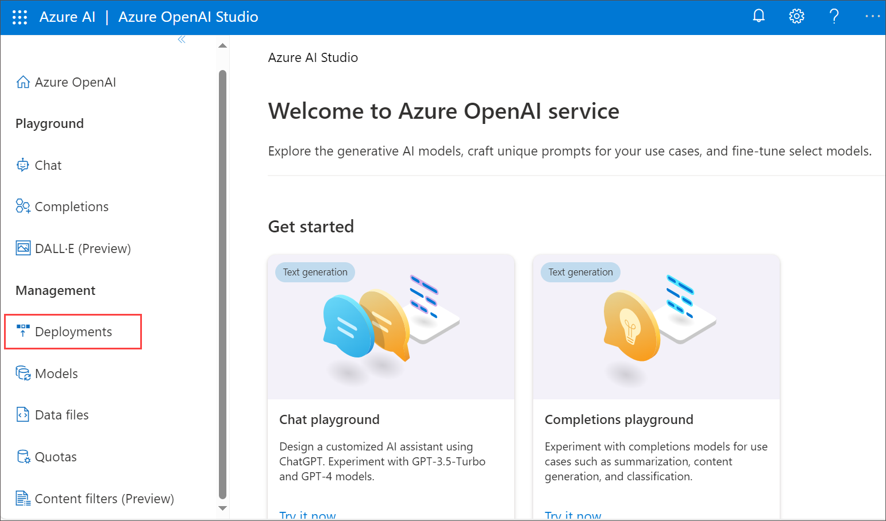
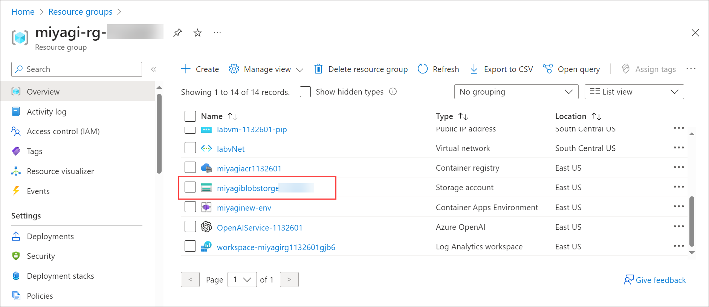
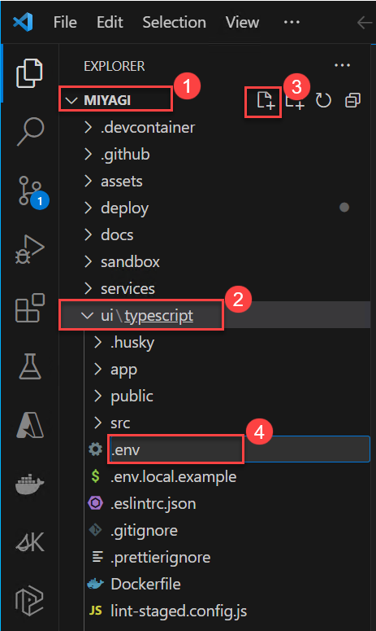
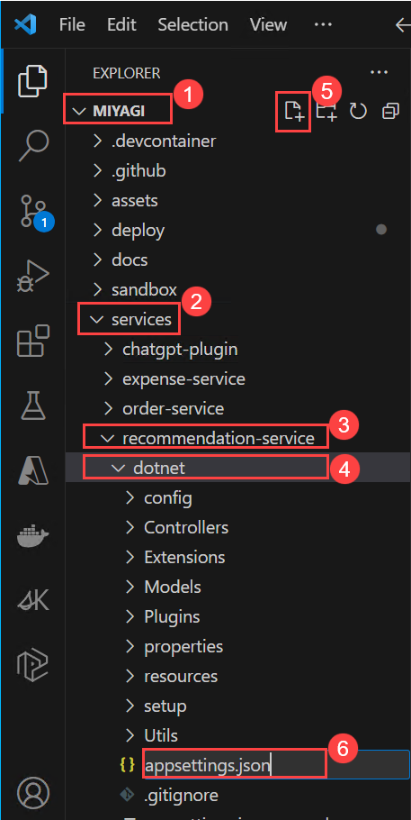
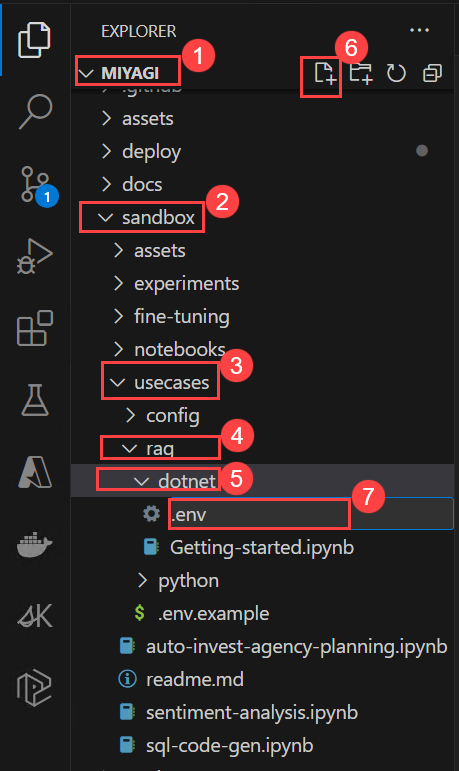

# Intelligent-Apps-Build-your-own-Copilot-Workshop

#### Task 1: Setup configuration for miyagi app

1. In Azure Portal, click on **Resource groups** from the Navigate panel.

1. From the Resource groups page, click on miyagi-rg-<inject key="DeploymentID" enableCopy="false"/>.
   

1. On **miyagi-rg-<inject key="DeploymentID" enableCopy="false"/>**, from the Overview (1) tab select the OpenAIService-<inject key="DeploymentID" enableCopy="false"/> (2).
   

1. On the OpenAI Overview (1) page and right-click on Go to Azure OpenAI Studio (2) button and click on Open link a new tab.

   .png)
   
1. When Pick an account window prompted kindly select your account to sign-in.
 

1. In the Azure AI Studio, select Deployments (1) under Management section.
   

1. On the Deployments blade of Azure AI Studio, select deployment name for gpt-35-turbo model and copy the full deployment name for gpt-35-turbo model.
   
   

1. Navigative back to **Deployment** page.    

1. On the Deployments blade of Azure AI Studio, select deployment name for text-embedding-ada-002 and copy the full deployment name for text-embedding-ada-002.
   
   

1. Navigate back to the tab displaying **Azure portal**. 

1. On **OpenAIService-<inject key="DeploymentID" enableCopy="false"/>** blade, under **Resource Management** section select **Keys and Endpoint** and copy the **Key1** and **Endpoints** values in notepade you need this values in furtur tasks.

   

1. Navigate back to miyagi-rg-<inject key="DeploymentID" enableCopy="false"/>.

1. On the miyagi-rg-<inject key="DeploymentID" enableCopy="false"/> page, select acs-<inject key="DeploymentID" enableCopy="false"/> from resources list.
   

1. On acs-<inject key="DeploymentID" enableCopy="false"/> blade copy the url you need this value in furture tasks.
   

1. On acs-<inject key="DeploymentID" enableCopy="false"/> blade, under **Settings** section, select **Keys** copy and record the Primary Admin Key.
   

1. Navigative back to resource group miyagi-rg-<inject key="DeploymentID" enableCopy="false"/> page, select cosmos-<inject key="DeploymentID" enableCopy="false"/> from resources list.
   

1. On cosmos-<inject key="DeploymentID" enableCopy="false"/> copy the Name and URL.
   

1. Navigate back to miyagi-rg-<inject key="DeploymentID" enableCopy="false"/>, select miyagiblobstorge<inject key="DeploymentID" enableCopy="false"/>.
   

1. Set your blobServiceUri https://(yourstorageservicename).blob.core.windows.net/

1. Within LabVM select Visual Studio Code which is presented on desktop, double click in it to open.

1. In Visual Studio Code from menu bar select **File**> **Open folder**, and  navigate to C:\LabFiles\miyagi click on **open folder**.

1. In Visual Studio Code if **Do you trust the authors of the files in this folder?** window prompted click **Yes, I trust the authors**.
   
   
1. Expand **miyagi**>**ui/typescript** and click on **New file** icon and create a new file called .env.
   

1. Copy paste the contents of .env.local.example into .env and save the file.

1. Create a new file named appsettings.json in miyagi/services/recommendation-service/dotnet
   
   
1. Copy paste the contents of appsettings.json.example into appsettings.json and save the file

1. Update appsettings.json with the values which you recorded in previous steps for the variables below.

1. For "deploymentOrModelId": "<Id of the completions model you deployed>", copy the deployment name for gpt-35-turbo model

1. For "embeddingDeploymentOrModelId": "<Id of the embedding model you deployed>", deployment name for text-embedding-ada-002

1. For "endpoint": "<Your Open AI Endpoint>", "apiKey": "<Your OpenAI API Key>",  Copy the Key1 to **apiKey** and endpoints to **Endpoint**.

1. For "azureCognitiveSearchEndpoint": "<Your Cognitive Search Endpoint>", "azureCognitiveSearchApiKey": "<Your Cognitive Search API Key>", copy Url to **azureCognitiveSearchEndpoint** and Key to 
   **azureCognitiveSearchApiKey**

1. For "cosmosDbUri": Replace "<Your Cosmos DB URI>" with Cosmos url , replace "cosmosDbName": "miyagi", with cosmos-<inject key="DeploymentID" enableCopy="false"/>

1. For "blobServiceUri": "<Your blobServiceUri>", replace <Your blobServiceUri> with https://miyagiblobstorge<inject key="DeploymentID" enableCopy="false"/>.blob.core.windows.net/

1. Leave default settings for  "cosmosDbContainerName": "recommendations","logLevel": "Trace"

1. Once afer updating the values kindly save the file by pressing **CTRL + S**.

1. Create a new file named .env in miyagi/sandbox/usecases/rag/dotnet

   
   
1. Copy paste the contents of .env.example into .env and save the file

1. Copy the values which you recorded into .env file and save the file

 #### Task 2: Setup .NET secrets

1. Navigate to miyagi/services/recommendation-service/dotnet, right click on dotnet and select **Open in intergate Terminal**.
1. Run the following command to set the secrets for the recommendation service. You will need to provide the values for the variables below.
   
     ```
          dotnet user-secrets set "USE_OPEN_AI" "False"
          dotnet user-secrets set "serviceType" "AzureOpenAI"
          dotnet user-secrets set "BING_API_KEY" "<Your Bing API Key>"
          dotnet user-secrets set "MEMORY_COLLECTION" "miyagi-embeddings"
          dotnet user-secrets set "deploymentOrModelId" "<Your Open AI Completions model Deployment Id>"
          dotnet user-secrets set "embeddingDeploymentOrModelId" "<Your Open AI Embeddings model Deployment Id>"
          dotnet user-secrets set "endpoint" "<Your Open AI Endpoint>" 
          dotnet user-secrets set "apiKey" "<Your Open AI API Key>"
          dotnet user-secrets set "COSMOS_DB_CONNECTION_STRING" "<Cosmos DB Connection String>"
         
     ```
   Use the following instructions to get the values for the arguments to the dotnet user-secrets set command

   -  **Bing API Key:** Provide **a6a11817493b4c2cb9a49d11bcd31e98**
   -  **"deploymentOrModelId"** Replace <Your Open AI Completions model Deployment Id> with deployment name for gpt-35-turbo model
   -  **"embeddingDeploymentOrModelId"** Replace  <Your Open AI Embeddings model Deployment Id> with deployment name for text-embedding-ada-002
   -  **Open AI Endpoint: Replace "<Your Open AI Endpoint>" with Open AI Endpoint
   -  **Open AI API Key:** Replace "<Your Open AI API Key>" with Open AI Key
   -  **Cosmos DB Connection String:** Go to Azure Portal -> Resource Groups -> miyagi-rg-<inject key="DeploymentID" enableCopy="false"/>  -> Select the cosmos-<inject key="DeploymentID" enableCopy="false"/>  -> Keys        > Copy the value of the Cosmos DB Connection String.


### 2.4 Understanding implementation of the recommendation service

Recommendation service implements RAG pattern using Semantic Kernel SDK. The details of the implementation are captured in the Jupyter notebook in the folder miyagi/sandbox/usecases/rag/dotnet. You can open the notebook in VSCode and run the cells to understand step by step details of how the Recommendation Service is implemented. Pay special attention to how RAG pattern is implemented using Semantic Kernel. Select kernel as .NET Interactive in the top right corner of the notebook.

1. In Visual Studio Code navigate to miyagi/sandbox/usecases/rag/dotnet folder and select **Getting-started.ipynb**

2. Execute the notebook cell by cell (using either Ctrl + Enter to stay on the same cell or Shift + Enter to advance to the next cell) and observe the results of each cell execution.

### 2.5 Run miyagi frontend locally

1. Open a new terminal: Terminal -> New Terminal (or Ctrl + Shift + `)

1. Change folder to miyagi/ui/typescript

1. Run the following command to install the dependencies
   
    ```
     npm install --global yarn
     yarn install
     yarn dev
    ```
1. Open a browser and navigate to
   ```
     http://localhost:4001
   ```
   Get the port from the logs in the terminal. You should see the miyagi app running locally.

   
   
### 2.6 Run recommendation service locally
1. Open a new terminal: Terminal -> New Terminal (or Ctrl + Shift + `)

1. Change folder to miyagi/services/recommendation-service/dotnet

1. Run the following command to run the recommendation service locally
    ```
     dotnet build
     dotnet run
    ```
1. Open a browser and navigate to
   ```
     http://localhost:<port>/swagger/index.html Default port is 5224
   ```
   Get the port from the logs in the terminal. You should see the swagger page for the recommendation service.

   
